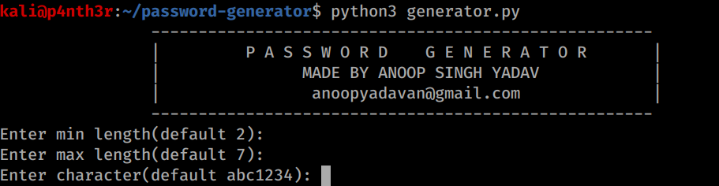

<h3>A tool of password generator.</h3>

<a href="https://github.com/anoopyadavan/password-generator/archive/master.zip">Download</a>

<h4>How to install</h4>
You can install it through gitclone or download it. You don't need to install or configure password-generator. Just download it and start using.
1. Move to password-generator.
2. Launch password-generator.py
3. Now you will get prompt to enter how you want your password enter it or press enter to get by default value.
